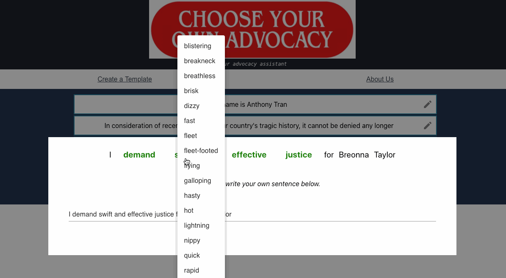

# Choose Your Own Advocacy
_Your advocacy assistant, inspired by the Choose Your Own Adventure series._

## Overview

***Q: What is this?***

A tool meant to make **advocacy and petition emails/letters more dynamic** in their content and to **combat the reduced efficacy of slacktivism.**

***Q: Why did you make this?***

Typically, petition templates are provided by activist organizations as a quick way for an average Joe/Jane to reach out to some person in question (e.g. Congressional representatives, senators, etc.). This raises mainly two concerns:

(1) Are emails being blocked by spam filters for being **too similar**?

(2) Do emails have reduced efficacy due to the **dry and redundant** nature of template emails?

I developed this in hopes of combatting these two concerns and also to increase engagement with activist causes (as opposed to just copypasting emails).

*Mostly a proof of concept trial, but could be expanded upon.*

## Current Features
- Madlibbing of most verbs, adjectives, and nouns
- Draggable sentences to rearrange template structure

## Demo

## Current Limitations
- Small set of synonyms to choose from
- Occasional grammatical mistakes when swapping words

## Future Moves
- Allow organizers to post their templates on the site so links can be generated and shared
- E-mail integration
- Randomization of text signatures (e.g. double spacing, double dash instead of one dash, etc.)

---
*Made with ReactJS and ExpressJS.*
*Used 'en-pos' for NLP and Merriam Webster for synoynyms.*
